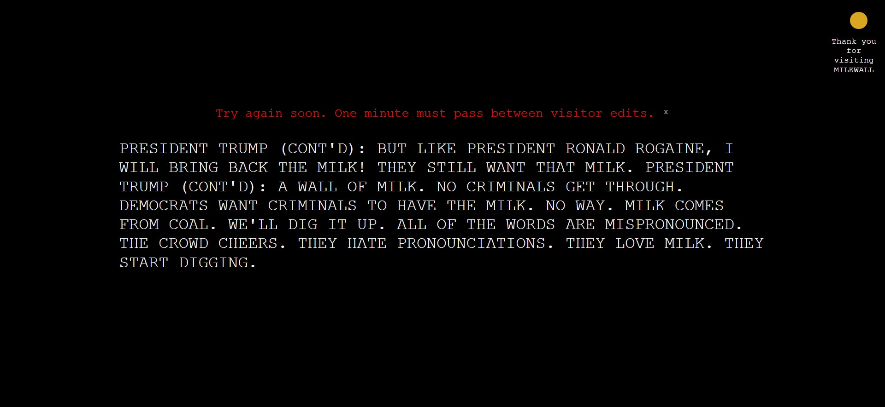

This is a single-page app whose text anyone can edit for all visitors.

# MILKWALL: The Global Wall of Text

## Live Site

[🥛 MILKWALL](https://prismatic-chimera-edeb3d.netlify.app/)

## Features

- Displays text edits immediately
- Backend database globalizes text contents securely
- Disallows edits until 1 minute has passed to allow others to view changes
- Sizes responsively for different viewports/browser window minimization

## Built with

 - managing text/editing states

 - basic site components

 - styling & viewport changes

 - basic logic in React & Express

 - backend server

 - simple database storing text & last edited time

 - containerization for Fly.io

 - backend hosting

 - frontend hosting

## Ideal Future Improvements

- add remaining char count above edit field
- add cancel editing button
- don't allow text to be reduced to empty string/only spaces
- timeout edit field after sitting over 3 mins
- remove error message if 10 mins have passed or change to a countdown timer

## Running the Project Locally

1. Clone from Github
2. `cd` into backend/ in bash/command line
3. `npm install` to install dependencies
4. `node app.js` to start backend server
5. `cd` into frontend/ in bash/command line
6. `npm install` to install dependencies
7. `npm start` to run the app in development mode
